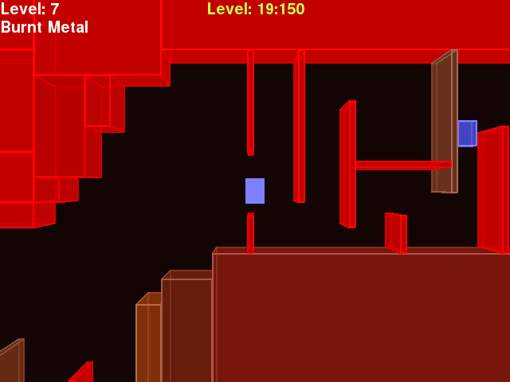

# Cool-Python-Platformer

A minimalistic platformer developed in pygame. Some notable features are: highscore system 
that tracks level completion times, the ability to race against ghosts of your previous records, 
and fully customizable levels through an in-game level editor.

The main purpose of this project is to gain experience with Python and develop a medium-sized project.

Here are some screenshots:

